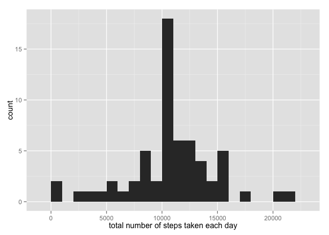

# Reproducible Research: Peer Assessment 1

# Loading and preprocessing the data


```r
data <- read.csv("activity.csv")
```

# What is mean total number of steps taken per day?
1. Make a histogram of the total number of steps taken each day


```r
library(ggplot2)

daysteps <- tapply(data$steps, data$date, FUN = sum, na.rm = TRUE)
qplot(daysteps, binwidth = 800, xlab = "total number of steps taken each day")
```

 

2. Calculate and report the mean and median total number of steps taken per day


```r
mean(daysteps, na.rm=TRUE)
```

```
## [1] 9354.23
```

```r
median(daysteps, na.rm=TRUE)
```

```
## [1] 10395
```

# What is the average daily activity pattern?
1. Make a time series plot (i.e. type = "l") of the 5-minute interval (x-axis) and the average number of steps taken, averaged across all days (y-axis)


```r
averagesteps <- aggregate(x = list(steps = data$steps), by = list(interval = data$interval), FUN = mean, na.rm = TRUE)

ggplot(averagesteps, aes(x = interval, y = steps)) + geom_line() + xlab("5-minute interval") + ylab("average number of steps taken")
```

 

2. Which 5-minute interval, on average across all the days in the dataset, contains the maximum number of steps?


```r
names(averagesteps)[2] <- "meansteps"

averagesteps[averagesteps$meansteps == max(averagesteps$meansteps),  ]
```

```
##     interval meansteps
## 104      835  206.1698
```

# Imputing missing values
1. Calculate and report the total number of missing values in the dataset (i.e. the total number of rows with NAs)


```r
sum(is.na(data))
```

```
## [1] 2304
```

2. Devise a strategy for filling in all of the missing values in the dataset. The strategy does not need to be sophisticated. For example, you could use the mean/median for that day, or the mean for that 5-minute interval, etc.

*My strategy is to let all of the missing values be filled in with mean value for that 5-minute interval.*

3. Create a new dataset that is equal to the original dataset but with the missing data filled in.


```r
fullfilldata <- data

for (i in 1 : nrow(fullfilldata)) {
  if (is.na(fullfilldata$steps[i])) {
    fullfilldata$steps[i] <- averagesteps[which(fullfilldata$interval[i] == averagesteps$interval), ]$meansteps
  }
}

head(fullfilldata)
```

```
##       steps       date interval
## 1 1.7169811 2012-10-01        0
## 2 0.3396226 2012-10-01        5
## 3 0.1320755 2012-10-01       10
## 4 0.1509434 2012-10-01       15
## 5 0.0754717 2012-10-01       20
## 6 2.0943396 2012-10-01       25
```

```r
sum(is.na(fullfilldata))
```

```
## [1] 0
```

4. Make a histogram of the total number of steps taken each day and Calculate and report the mean and median total number of steps taken per day. 


```r
daysteps <- tapply(fullfilldata$steps, fullfilldata$date, FUN = sum, na.rm = TRUE)

qplot(daysteps, binwidth = 1000, xlab = "total number of steps taken each day")
```

 

```r
mean(daysteps)
```

```
## [1] 10766.19
```

```r
median(daysteps)
```

```
## [1] 10766.19
```

5. Do these values differ from the estimates from the first part of the assignment? What is the impact of imputing missing data on the estimates of the total daily number of steps?

*Both values are larger than the previous values. The reason is that all the missing values are '0' in calculating the mean and median values in the first part, but after these replacement, these values are the exact mean value of that 5-minute interval, which is larger than 0. So the new mean and median values must be larger. *

# Are there differences in activity patterns between weekdays and weekends?

1. Create a new factor variable in the dataset with two levels – “weekday” and “weekend” indicating whether a given date is a weekday or weekend day. 


```r
weekdayend <- function(date){
  dayweek <- weekdays(date)
  if (dayweek %in% c("Monday", "Tuesday", "Wednesday", "Thursday", "Friday")) {
    return("weekday")
  }
  else if (dayweek %in% c("Saturday", "Sunday")){
    return("weekend")
  }
  else {
    stop("invalid date")
  }
}

fullfilldata$date <- as.Date(fullfilldata$date)

fullfilldata$day <- sapply(fullfilldata$date, FUN = weekdayend)
```

2. Make a panel plot containing a time series plot (i.e. type = "l") of the 5-minute interval (x-axis) and the average number of steps taken, averaged across all weekday days or weekend days (y-axis). 


```r
averagesteps <- aggregate(steps ~ interval + day, data = fullfilldata, mean)

ggplot(averagesteps, aes(interval, steps)) + geom_line() + facet_grid(day ~ .) + xlab("5-minute interval") + ylab("Number of steps")
```

 
